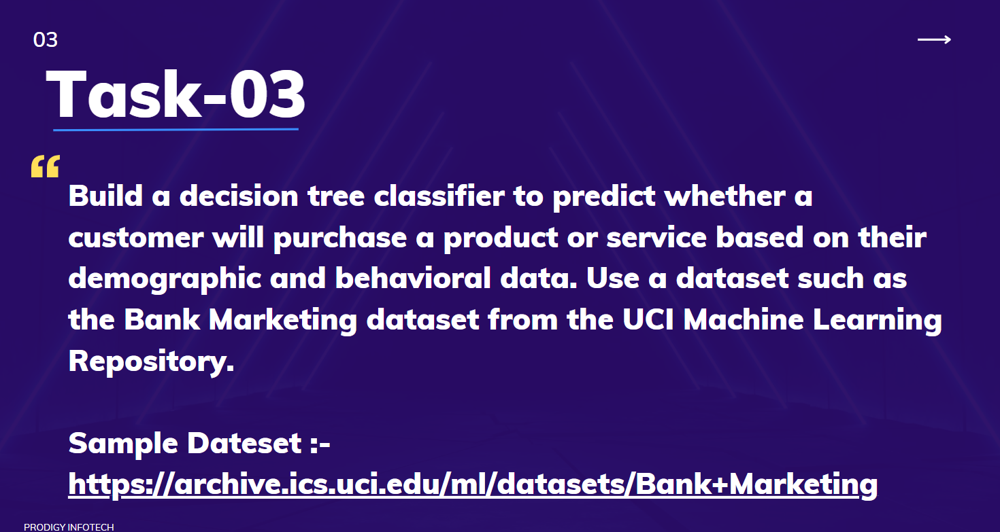

# Prodigy InfoTech Data Science Internship Task 2  
 

### Welcome to Task 3 Submission 🎯 
This project implements a **Decision Tree Classifier** to predict whether a customer will purchase a product or service based on demographic and behavioral data. The model is trained using the **Bank Marketing dataset** from the **UCI Machine Learning Repository**.  
# Decision Tree Classifier for Customer Purchase Prediction  

### 📌 Objective  
The objective of this project is to **develop a Decision Tree Classifier** that can predict whether a customer will purchase a product or service based on **demographic and behavioral data**. The model aims to help businesses improve marketing strategies by identifying potential customers more effectively.  

## 📂 Dataset  
The **Bank Marketing dataset** contains data from a Portuguese bank's direct marketing campaigns. The goal is to predict whether a customer will subscribe to a term deposit (`yes` or `no`).  

### 🔹 Features:  
- **Demographic data** (e.g., age, job, marital status, education)  
- **Behavioral data** (e.g., previous campaign contact, number of contacts, last contact duration)  
- **Economic indicators** (e.g., consumer confidence index, interest rates)  

## 🛠️ Technologies Used  
- **Python**  
- **Scikit-Learn** (Decision Tree Classifier)  
- **Pandas** (Data Handling)  
- **Matplotlib & Seaborn** (Visualization)  

## 📊 Analysis Highlights  
- **Feature Importance:** Certain features, such as **last contact duration** and **previous campaign contact**, significantly influence the prediction outcome.  
- **Imbalance Handling:** The dataset is slightly imbalanced; techniques like **resampling** or **class weighting** were used to handle this issue.  
- **Overfitting & Pruning:** Decision Trees are prone to overfitting, so **pruning** was applied to enhance the model's ability to generalize.  
- **Evaluation Metrics:** The model was evaluated using **accuracy, precision, recall, and F1-score**, ensuring a comprehensive performance assessment.  

## 🏁 Conclusion  
The Decision Tree Classifier successfully predicts customer purchases, offering valuable insights for businesses to better target potential customers. The model provides a solid foundation, and future improvements could include using more advanced methods like **Random Forest** or **Gradient Boosting** to further enhance prediction accuracy and performance.  
